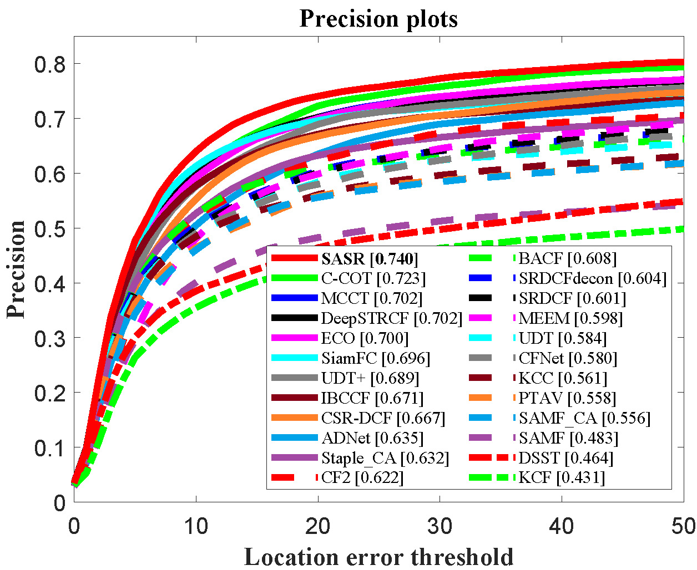
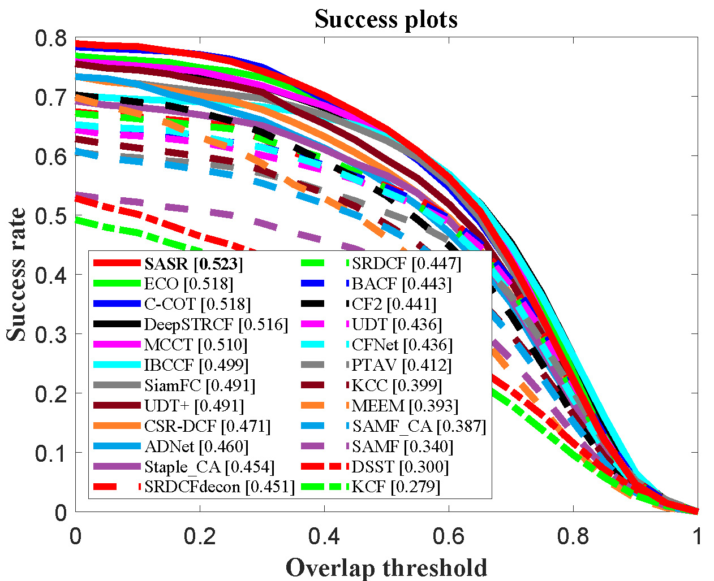
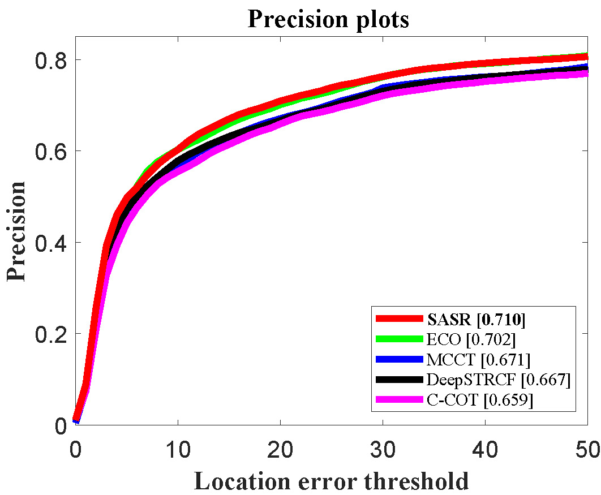
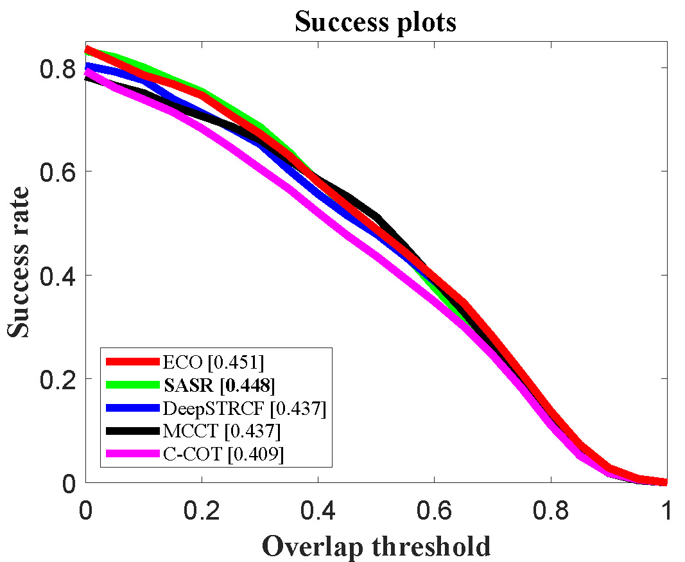

## SASR

This repository is the matlab implementation for "Surrounding-Aware Correlation Filter for UAV Tracking  with Selective Spatial Regularization"
Video available at [YouTube](https://youtu.be/VDvuNhQ5UMc)

### Overall Performance

SASR performs favorably against 23 state-of-the-art trackers on challenging UAV tracking sequences from UAV123 and UAVDT.

<div  align="left">
    <center>Figure 1 Performance on 100 challenging sequences from UAV123<center>


   <br> <br>
            <center>Figure 2 Performance TOP-5 trackers from Fig.1 on UAVDT<center>


</div>


### Installation

1. Download zipfile of this repository and extract it somewhere or use git:

   $ git clone <https://github.com/vision4robotics/SASR-tracker.git>

2. Download matconvnet from the [homepage](http://www.vlfeat.org/matconvnet) or [Github](<https://github.com/vlfeat/matconvnet>), and Piotr Dollár's toolbox from [Webpage]( <https://pdollar.github.io/toolbox/>) or [GitHub](https://github.com/pdollar/toolbox) . Then, extract them at `.\SASR_release_v1.0\external_libs`

3. Start Matlab and navigate to this repository, run `install.m` to compile Piotr Dollár's toolbox and matconvnet. This step may take some time and you may see a lot of warnings. The script will automatically download `imagenet-vgg-m-2048.mat` used in SASR, it may take some time depending on your Internet. You can manually download it from [here](http://www.vlfeat.org/matconvnet/models/imagenet-vgg-m-2048.mat). If you have it already, just copy it to `.\SASR_release_v1.0\feature_extraction\networks`. 

4. Run `SASR_single_seq.m`, you will be able to chose `wakeboard5` with GUI.


#### Possible Issues

The code is tested on Matlab R2017b with CUDA 8.0.

Matconvnet is also the latest when this work is completed.

If your matlab version is R2018a or later, you may have to make a few modifications in `\SASR_release_v1.0\external_libs\matconvnet\matlab\vl_compilenn.m`.

First, modify line 359 into 

```matlab
flags.mexlink = {'-lmwblas'};
```

Then, modify line 620 into

```matlab
args = horzcat({'-outdir', mex_dir}, ...
flags.base, flags.mexlink, ...
'-R2018a',... % your matlab version here
{['LDFLAGS=$LDFLAGS ' strjoin(flags.mexlink_ldflags)]}, ...
{['LDOPTIMFLAGS=$LDOPTIMFLAGS ' strjoin(flags.mexlink_ldoptimflags)]}, ...
{['LINKLIBS=' strjoin(flags.mexlink_linklibs) ' $LINKLIBS']}, ...
objs) ;
```

If you want to use cuDNN toolkit, you may have to install cuDNN and modify `\SASR_release_v1.0\install.m`

Modify line 30 into 

```matlab
        vl_compilenn('enableGpu',true,...
            'cudaRoot','C:\Program Files\NVIDIA GPU Computing Toolkit\CUDA\v9.0',...% path to your cuda
            'cudaMethod','nvcc',...
            'enableCudnn',true,...    % if you don't want to use cudnn, set it to 'false'
            'cudnnRoot','C:\Program Files\NVIDIA GPU Computing Toolkit\CUDA\v9.0'); % path to your cudnn
```


If you are using visual studio 2017 or newer version, matlab may not be able to find `cl.exe`, in this case, you need to manually set the path to it.

Modify line 659 into

```matlab
cl_path = "YOUR PATH TO cl.exe";
```


### Acknowledgement

We thank for Dr. Li Feng and his team for their valuable help on our work.

We have borrowed some codes from the [STRCF tracker](<https://github.com/lifeng9472/STRCF>) 


